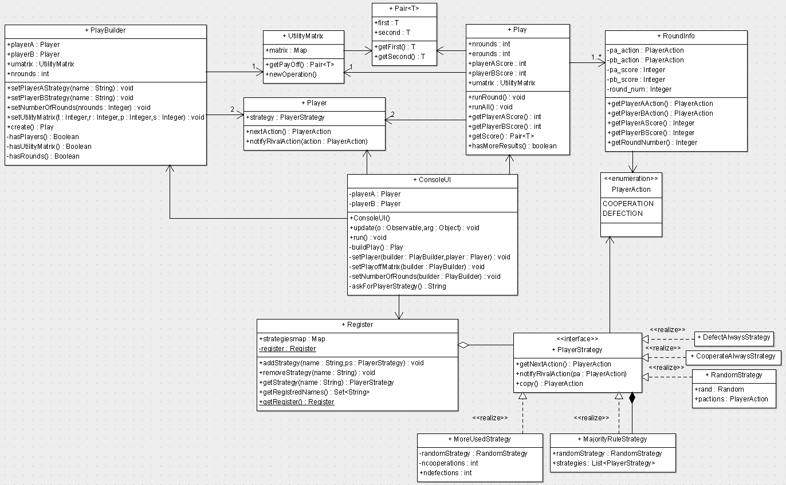

<h1>Informe del Dilema del Presoner Iterat</h1>
<h2>Dilema del Presoner</h2>

En teoria de jocs, el <b>dilema del presoner</b> és un tipus de joc de suma no nul·la en el qual dos jugadors poden «cooperar» o «trair-se». En aquest joc, igual que en totes les situacions de teoria de jocs, l'única preocupació de cada jugador individual és maximitzar els seus beneficis, independentment del benefici de l'altre jugador.

Aquest dilema sol expressar-se com a dos presoners que són interrogats per separat i, segons les seves decisions, obtenen les següents condemnes:

<table style="width:100%">
<tr>
  <td></td><td>PresonerB calla</td><td>Presoner B confessa</td>
</tr>
<tr>
  <td>Presoner A calla</td><td>A 1 any, B 1 any</td><td>A 3 anys, B 0 anys</td>
</tr>
<tr>
  <td>Presoner A confessa</td><td>A 0 anys, B 3 anys</td><td>A 2anys, B 2 anys</td>
</tr>
</table>

Com els presoners no poden preveure la decisió de l’altre, sempre trien “trair-se”, ja que és la decisió que més beneficiosa de forma individual (0 anys si l’altre coopera i 2 anys enlloc de tres si l’altre ens traeix). Com tots dos arriben a la mateixa conclusió, el resultat previsible sempre és doble traïció. Una forma de demostra que les millors decisions individuals no generen la millor solució final (1 any per cada un si haguessin col·laborat).

<h2>Dilema del Presoner Iterat</h2>

En el <b>dilema del presoner iterat</b>, la cooperació pot obtenir-se com un resultat d'equilibri. Aquí es juga repetidament, per la qual cosa, quan es repeteix el joc, s'ofereix a cada jugador l'oportunitat de castigar a l'altre jugador per la no cooperació en jocs anteriors. Així, l'incentiu per trair pot ser superat per l'amenaça del càstig, la qual cosa condueix a un resultat cooperatiu. Si el joc es repeteix indefinidament s'assoleix un equilibri de Nash, tot i que la traïció segueix sent una possible situació d'equilibri.

Per entendre com funciona el joc cal entre la matriu d’opcions com:

<table style="width:100%">
<tr>
  <td></td><td colspan="2">B coopera</td><td colspan="2">B deserta</td>
</tr>
<tr>
  <td rowspan="2">A coopera</td><td>Presoner A</td><td>PresonerB</td><td>Presoner A</td><td>PresonerB</td>
</tr>
<tr>
  <td>R=1</td><td>R=1</td><td>S=3</td><td>T=0</td>
</tr>
<tr>
  <td rowspan="2">A deserta</td><td>Presoner A</td><td>PresonerB</td><td>Presoner A</td><td>PresonerB</td>
</tr>
<tr>
  <td>T=0</td><td>S=3</td><td>P=2</td><td>P=2</td>
</tr>
</table>
<ul>
  <li>Temptació(T): La recompensa per desertar quan l'altre cooperi.</li>
  <li>Premi(R): La recompensa per la col·laboració mútua.</li>
  <li>Càstig(P): La recompensa per la deserció mútua.</li>
  <li>Pringat(S): La recompensa per 'fer el primo' i cooperar quan l'altre deserta.</li>
</ul>

Hi ha dos condicions que s’han de complir per a que la matriu d’utilitat correspongui a la del dilema del presoner.

<ol>
  <li>T > R > P > S</li>
  <li>R > (T+S)/2</li>
</ol>

La primera condició indica que la cooperació mútua (R) es millor que la deserció mútua (P), l’únic problema és que no podem saber si l’altre no caurà en la temptació (T) e intenti aprofitar-se de nosaltres (S). La segona indica que si en una ronda un jugador obté (T), malgrat que a l’altra obtingui (S), no podrà recuperar-se de no haver guanyat totes dues partides (R).
L'objectiu a llarg termini és guanyar el màxim de punts al final d'un nombre determinat de voltes. A cada volta, tots dos jugadors es decideixen entre cooperar (C) o desertar (D) de forma simultània i sense conèixer la decisió de l'altre (com a l'apartat anterior). Això sí, a l’analitzar cada ronda, s'atorguen els punts segons la matriu i s'informa a cada jugador de l'opció triada per l'altre jugador (de manera que, a la ronda n el jugador coneix, i pot utilitzar si vol, els resultats de les n-1 rondes anteriors).

Anomenarem	estratègia a l'algoritme seguit per cada jugador per tal de decidir-se entre cooperar o desertar (pot fer ús de la història de la partida jugada fins al moment). Exemples d'estratègies:

<ul>
  <li>Per xula jo: desertar sempre, independentment del que hagi fet l'altre.</li>
  <li>Càndida: cooperar sempre, independentment del que hagi fet l'altre. Com l'anterior, es tracta d'una estratègia cega.</li>
  <li>Atzarosa: escollir a l'atzar.</li>
  <li>Intel∙ligent: tenir en compte les rondes anteriors per tan de prendre la decisió (p.e. cooperar a menys que l'altra hagi desertat més d'una vegada.</li>
  <li>MoreUsedStrategy: Aquesta estratègia respon amb l’acció que l’altre jugador ha utilitzat més vegades, si l’altre jugador ha realitzat el mateix nombre de vegades les possibles accions, respon amb una aleatoriament.</li>
  <li>MajorityRuleStrategy: Aquesta estratègia esta composta per altres estratègies i per cada cop que ha de prendre una acció, respon amb l’estratègia més triada per les estratègies que la formen. En cas que totes les possibles accions s’hagin triat el mateix nombre de vegades, respon de forma aleatòria</li>
</ul>

No hi ha una estratègia òptima en el sentit de què és la millor davant qualsevol altra ja que, els resultats d'una estratègia depenen de quina sigui l'estratègia seguida per l'altre.

<h2>El Programa</h2>

Es vol realitzar una aplicació per simular tornejos del dilema del presoner iterat. En concret, l'usuari podrà escollir l'estratègia emprada per cada jugador, el nombre de	rondes que tindrà la partida i els valors de la matriu d'utilitat. De cara a fer això, el sistema tindrà implementat diverses estratègies predefinides (algunes d'elles cegues, algunes probabilistes i d'altres intel∙ligents).

</img>

També permetrem la definició d'estratègies mixtes que es formin per combinació de dues o més estratègies definides en el sistema (així podrem ampliar el repertori d'estratègies). Per exemple: una forma de combinar seria escollir tres estratègies base i retornar el resultat de la majoria. Per a fer això, el sistema tindrà definit un mecanisme de combinació d'estratègies que permeti definir noves estratègies per a ser utilitzades a les partides.

<h2>Model de Disseny</h2>

En aquest apartat es defineixen les classes principals que hi intervenen i les seves responsabilitats.

<ul>
  <li>Classe UtilityMatrix</li>
    <ul>
      <li>Representa la matriu d’utilitat</li>
    </ul>
  <li>Classe Play</li>
    <ul>
      <li>Representa una partida</li>
      <li>Coneix els dos jugadors que participen</li>
      <li>Coneix la matriu d’utilitat</li>
      <li>Coneix la puntuació de la partida</li>
      <li>Executa una partida a un determinat número de rondes</li>
    </ul>
  <li>PlayBuilder</li>
    <ul>
      <li>L’objectiu de tenir aquesta classe és aïllar el client d’algunes de les classes del domini com Player o UtilityMatrix</li>
    </ul>
  <li>Classe Player</li>
    <ul>
      <li>Coneix la seva estratègia</li>
      <li>Delega sobre l’estratègia les decisions</li>
      <li>Informe a l’estratègia de les decisions de l’altre jugador</li>
    </ul>
  <li>Classe PlayerStrategy</li>
    <ul>
      <li>defineix el mètode per prendre la decisió (col∙laborar o desertar)</li>
      <li>defineix el mètode per informar de la decisió a l’altre jugador (important per les estratègies intel∙ligents)</li>
      <li>defineix el mètode que permet fer una còpia profunda d’ell mateixa</li>
    </ul>
  <li>Classe DefectAlwaysStrategy</li>
    <ul>
      <li>És la implementació de la estratègia “pa xula jo”</li>
    </ul>
  <li>Classe CooperateAlwaysStrategy</li>
    <ul>
      <li>És la implementació de la estratègia candida</li>
    </ul>
  <li>Classe RandomStrategy</li>
    <ul>
      <li>És la implementació de la estratègia atzarosa</li>
    </ul>
  <li>Classe MoreUsedStrategy</li>
    <ul>
      <li>És la implementació de la estratègia MoreUsedStrategy</li>
    </ul>
  <li>Classe MajorityRuleStrategy</li>
    <ul>
      <li>És una classe composta per altres estratègies, que implementa la estratègia MajorityRuleStrategy</li>
    </ul>
  <li>Classe RoundInfo</li>
    <ul>
      <li>Representa el resultat de punts pel parell d’accions escollides pels dos jugadors</li>
    </ul>
  <li>Classe Register</li>
    <ul>
      <li>Serveix per guardar, sota un nom, les estratègies definides al joc</li>
      <li>Quan se li demana una estratègia, donat un nom, retorna una còpia de l’estratègia guardada sota aquest</li>
    </ul>
  <li>Pair<T></li>
    <ul>
      <li>S’ha implementat principalment per representar les parelles de valors de la payoff matrix, tot i que també s’utilitza en alguns mètodes, com en getScore() de la classe Play per tal de retornar la puntuació dels dos jugadors.</li>
    </ul>
</ul>

